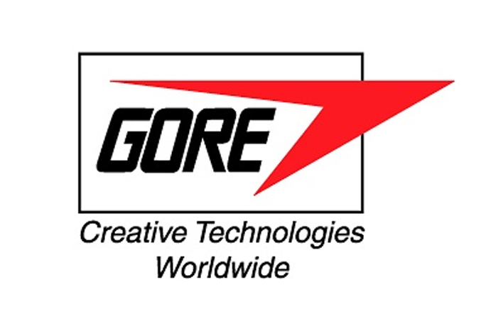
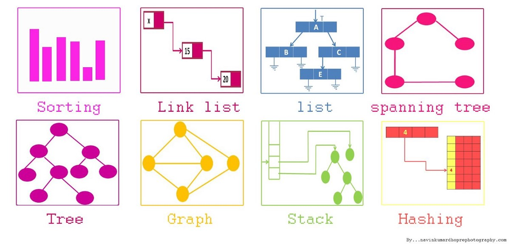

# Ryan Demboski's Portfolio
Computer Science Graduate (Bachelor of Science)  
  

Welcome! This is my personal website where you can see some of the different projects that I worked on while at University and in my free time. Thanks for looking!
  
Check out my GitHub Profile: <button class="btn btn-success" onclick=" window.open('https://github.com/rdemboski','_blank')"> My Github</button>

Also, here's my LinkedIn. Feel free to connect with me over there!: <button class="btn btn-success" onclick=" window.open('https://www.linkedin.com/in/ryan-demboski/','_blank')"> My LinkedIn</button>

**I'm currently looking for software development opportunities!** Either remote work, or work on-site in Arizona or Michigan.

 

# Personal Skills I Will Provide You

<ul>
  <li>Works well independently or in a team</li>
  <li>Excellent communicator</li>
  <li>Strong work ethic</li>
  <li>Knows when to ask for help</li>
</ul>

And, most importantly of all:
<ul>
  <li>Dependable</li>
</ul>

 

# Technical Skills I Will Provide You

<ul>
  <li>.NET Core (C#)</li>
  <li>Java (Full-Stack)</li>
  <li>Python3 (Full-Stack)</li>
  <li>MEAN (MongoDB, ExpressJS, Angular/React, NodeJS)</li>
  <li>Frontend Skills (HTML, CS, JS)</li>
  <li>Relational AND NoSQL Database Systems</li>
</ul>

 

# Projects I've Worked On:

 

## NAU Senior Capstone Project

In this project, I have taken the role of Team Lead for our team GreenAZ. The mission of the project is to develop a web visualization system with a MEAN stack **(MongoDB, Express.js, Angular, Node.js)** application, and **GIS mapping** technologies. It will be deployed with **Podman/Docker**.

Official Project Video:

View our team website here: <button class="btn btn-success" onclick=" window.open('https://ceias.nau.edu/capstone/projects/CS/2022/GreenAZ_F22/','_blank')"> Team Website</button>

Check out the live project website here: <button class="btn btn-success" onclick=" window.open('https://ceias.nau.edu/circularize-dev/','_blank')"> Circularize Project</button>

Github organization: <button class="btn btn-success" onclick=" window.open('https://github.com/circularize','_blank')"> Project Repo</button>

  

## Operating System Simulator

This was a complex command line project **written in C** and excuted within a **Linux terminal**. 

The program provides a real-time simulation of an operating system using a meta-data file filled with operation codes of any size and any order. A configuration file is also used to determine the output method and other details. All string utilities are written from scratch. **Uses threading, various CPU scheduling techniques, memory management, and PCBs (process control blocks)**.

Check out the demo video below!

Github repository: *available upon request*

  

## ASP.NET Web Forms With Camstar API & Backend

This was my summer project during my internship last year. I worked with full-time Camstar MES specialists and database administrators, while I developed new functionality into an existing full-stack enterprise application. During my time with this company I gained professional experience with **ASP.NET, C#, HTML/CSS/jQuery, and MSSQL**.

Unfortunately I cannot provide videos, pictures, or sample code of this project as it is confidential, but I am more than happy to discuss more about the skills that I gained from this experience.

**Note:** At the end of this internship I also lent my help to another application that ran **Node.js, React, Express.js, and MongoDB**. This is what gave me inspiration to persuit this tech stack for my capstone project, because I really enjoyed learning about it.

  

## Social Square - Event Organizing Platform

This was a project for NAU's Software Engineering course. I took it my Junior year.

It is an **ASP.NET Core** application that uses an **MVC** architecture. It also used **Razor web pages** for CSHTML functionality. I was with a group of 5 people, and I was *team lead & the main backend developer*. I also served as the *quality assurance* lead and I reviewed all pull-requests.

Check out the demo video below!

Github repository: <button class="btn btn-success" onclick=" window.open('https://github.com/rdemboski/cs386_Group3','_blank')"> Project Repo</button>

  

## Java Web Socket Server

This was a project I completed last semester for my Computer Networks class. I learned how to use **Java Sockets** to create a web server that can GET/POST HTTP requests. I used several console logs to show when a client connects, and several other diagnostic messages.

Check out the demo video below!

Github repository: <button class="btn btn-success" onclick=" window.open('https://github.com/rdemboski/Java-Practice/tree/main/web-assignment-1','_blank')"> Project Repo</button>

  

## Java GUI Application With Backend - Enroll Students Into College Classes

This was my final project for my Database Systems course at NAU. I took it during my Sophomore year. In this project I learned how to utilize Java to make a full stack GUI application. In this case I was using **MySQL and phpMyAdmin** as the database system.

Check out the demo video below!

Github repository: <button class="btn btn-success" onclick=" window.open('https://github.com/rdemboski/Java-Practice/tree/main/EnrollmentApplication','_blank')"> Project Repo</button>

  

## Data Structures & Algorithms

I took a Data Structures course my Sophomore year, and I'm currently taking Algorithms during my final semester. In these classes I've learned the basics of the most common data structures, and how to use them to solve complex algorithm puzzles with code. In these classes, we used **Java and C** for our solutions, but since then I've done most of my independent practice with **Python3**.

Also, we were taught about **Big-O notation**, **Time and Space complexity**, and **Best/Worst case scenarios**.

I'm very involved on **LeetCode**, Daily Algorithm Problem websites, and actively participate in **mock interviews** to continue to brush my skills on these essential topics.

Lastly, *I helped tutor the Data Structures course at NAU for 3 years* (CS-249).

Github repository: <button class="btn btn-success" onclick=" window.open('https://github.com/rdemboski/Class-Projects/tree/master/Data%20Structures%20%26%20Algorithms','_blank')"> Project Repo</button>
